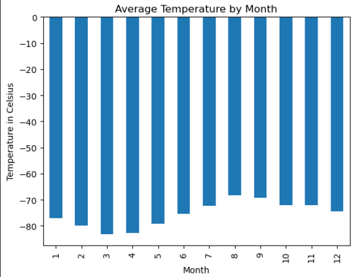
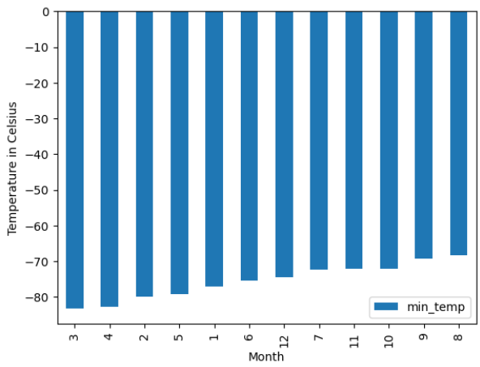
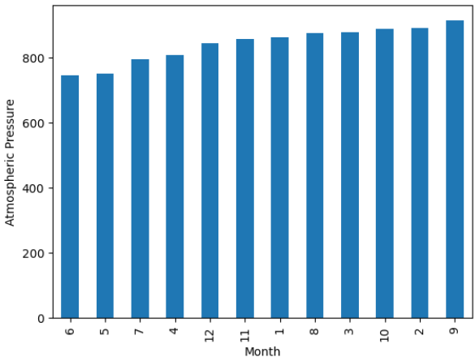
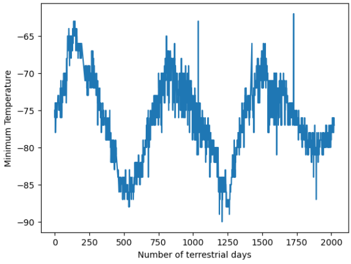

# Data_collection_challenge

## Installation

To run the dependencies you need to have the following Python libraries installed:

Matplotlib: It's a Python 2D plotting library which produces publication-quality figures in a variety of hardcopy formats and interactive environments across platforms. You can install it using pip:

```bash
pip install matplotlib
```

Pandas: It's an open-source library providing high-performance, easy-to-use data structures and data analysis tools for the Python programming language. You can install it using pip:

```bash
pip install pandas
```

Splinter: You can install Splinter using pip, the Python package manager. Open your terminal or command prompt and run the following command:

```bash
pip install splinter
```
BeautifulSoup: Similarly, you can install BeautifulSoup using pip. Run the following command in your terminal or command prompt:

```bash
pip install beautifulsoup4
```

Install jsonify: jsonify is a function in Flask that converts Python objects to JSON responses. However, jsonify is already included in Flask, so you don't need to install it separately. Just make sure you have installed Flask as indicated in the previous step.

After running these commands, Flask and jsonify will be installed in your Python environment, and you'll be able to import them in your Python scripts using the import statement you provided:

```bash
from flask import Flask, jsonify
```

Once you have installed these libraries, you will be able to run the code smoothly. Make sure you also have a Python environment set up correctly so that you can import these libraries in your scripts.

## Steps generated before starting

Create a new repository for this project called Data_collection_challenge.

I cloned the new repository to my computer.

Within your local Git repository, create a directory for this challenge.

Add:

Deliverable 1: A Jupyter notebook containing code that scrapes the Mars news titles and preview text.

Deliverable 2: A Jupyter notebook containing code that scrapes the Mars weather data and that cleans, visualizes, and analyzes that data.

To this folder.

Push changes to GitHub or GitLab.

## Task

Here are the steps to complete the tasks outlined in the assignment:

- Part 1: Scrape Titles and Preview Text from Mars News
  
Automated Browsing with Splinter:

Use Splinter to automate browsing and visit the Mars news site.
Inspect the page using Chrome DevTools to identify the HTML elements containing the titles and preview text of the news articles.
Extracting Data with Beautiful Soup:

Create a Beautiful Soup object and use it to extract the text elements from the website.
Identify the HTML elements containing the titles and preview text, and use Beautiful Soup to extract their content.
Storing Scraped Data:

Store the scraped titles and preview text in Python data structures.
Create dictionaries for each news article, with keys 'title' and 'preview', and store them in a list.
Printing and Exporting Data:

Print the list of dictionaries containing the scraped data in your Jupyter Notebook.
Optionally, export the scraped data to a JSON file.

- Part 2: Scrape and Analyze Mars Weather Data
  
Automated Browsing with Splinter:

Use Splinter to automate browsing and visit the Mars Temperature Data Site.
Inspect the page using Chrome DevTools to identify the HTML elements containing the weather data.
Extracting Data with Beautiful Soup:

Create a Beautiful Soup object and use it to scrape the data in the HTML table.
Assemble the scraped data into a Pandas DataFrame with the correct column headings.
Data Analysis:

Analyze the dataset using Pandas functions to answer the provided questions:
How many months exist on Mars?
How many Martian days' worth of data are there?
Which month, on average, has the lowest and highest temperature?
Which month, on average, has the lowest and highest atmospheric pressure?
How many terrestrial days exist in a Martian year?
Data Visualization:

Create data visualizations to support the answers to the analysis questions.












- Exporting Data:

Export the DataFrame containing the scraped data to a CSV file.


## References

- https://html.spec.whatwg.org/

- https://www.crummy.com/software/BeautifulSoup/bs4/doc/

- https://developer.chrome.com/docs/devtools?hl=es-419

- https://splinter.readthedocs.io/en/latest/

- https://flask.palletsprojects.com/en/3.0.x/

- https://git.bootcampcontent.com/University-of-Adelaide/UADEL-VIRT-DATA-PT-12-2023-U-LOLC

- https://matplotlib.org/

- https://www.python.org/

- https://pandas.pydata.org/docs/
